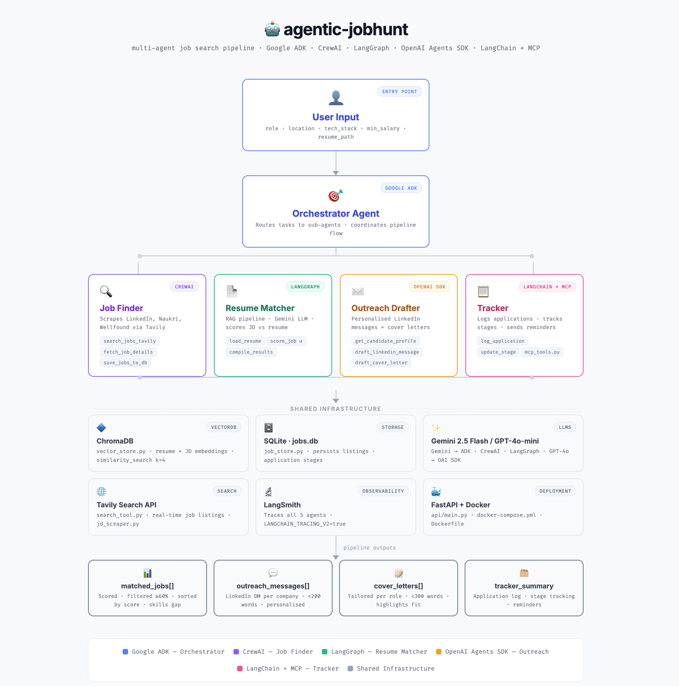

# 🤖 Agentic JobHunt — Multi-Agent Job Search Assistant

A personal Agentic AI system that autonomously finds, evaluates, and helps apply for Engineering Manager roles — built as a multi-framework showcase using **Google ADK**, **CrewAI**, **LangGraph**, **OpenAI Agents SDK**, and **LangChain**.

> Built by Ragavendran Ramalingam as a hands-on Agentic AI learning project.

---

## 🏗️ Architecture

[View Architecture](https://ragavendran-r.github.io/agentic-jobhunt/blob/main/docs/architecture.html)



### Agents

| Agent              | Framework         | Responsibility                                           |
| ------------------ | ----------------- | -------------------------------------------------------- |
| **Orchestrator**   | Google ADK        | Accepts user preferences, routes tasks to sub-agents     |
| **Job Finder**     | CrewAI            | Scrapes LinkedIn, Naukri, Wellfound for matching roles   |
| **Resume Matcher** | LangGraph         | Scores JD vs resume, identifies gaps, suggests tailoring |
| **Outreach**       | OpenAI Agents SDK | Drafts personalized cold messages and cover letters      |
| **Tracker**        | LangChain + MCP   | Logs applications, tracks stages, sends reminders        |

---

## 🛠️ Tech Stack

- **Language:** Python 3.11+
- **Frameworks:** Google ADK, CrewAI, LangGraph, OpenAI Agents SDK, LangChain
- **LLMs:** Gemini 2.5 Flash (ADK/CrewAI), GPT-4o-mini (OpenAI SDK)
- **Vector Store:** ChromaDB (resume + JD embeddings)
- **Storage:** SQLite (job application tracking)
- **Search:** Tavily Search API
- **Observability:** LangSmith (tracing across all agents)
- **Deployment:** Docker + FastAPI

---

## 📁 Project Structure

```
agentic-jobhunt/
├── app_agents/
│   ├── orchestrator.py       # Google ADK orchestrator
│   ├── job_finder.py         # CrewAI job scraping agent
│   ├── resume_matcher.py     # LangGraph resume scoring pipeline
│   ├── outreach.py           # OpenAI Agents SDK outreach drafter
│   └── tracker.py            # LangChain + MCP application tracker
├── tools/
│   ├── search_tool.py        # Tavily search wrapper
│   ├── resume_parser.py      # PDF resume parser
│   ├── jd_scraper.py         # Job description scraper
│   └── mcp_tools.py          # MCP tool definitions
├── memory/
│   ├── vector_store.py       # ChromaDB vector store
│   └── job_store.py          # SQLite job tracker store
├── api/
│   └── main.py               # FastAPI entrypoint
├── config/
│   └── settings.py           # Environment and config
├── tests/
│   ├── test_job_finder.py
│   ├── test_resume_matcher.py
│   └── test_outreach.py
├── docs/
│   └── architecture.md
├── docker-compose.yml
├── Dockerfile
├── requirements.txt
├── .env.example
└── README.md
```

---

## 🚀 Getting Started

### 1. Clone the repo

```bash
git clone https://github.com/ragavendran-r/agentic-jobhunt.git
cd agentic-jobhunt
```

### 2. Set up environment

```bash
python -m venv venv
source venv/bin/activate  # Windows: venv\Scripts\activate
pip install -r requirements.txt
```

### 3. Configure environment variables

```bash
cp env.example .env
# Fill in your API keys in .env
```

### 4. Run the app

```bash
# Direct CLI
python -m app_agents.orchestrator

# Via API
uvicorn api.main:app --reload

# Via Docker
docker-compose up
```

---

## 🔑 Environment Variables

```env
GOOGLE_API_KEY=           # Gemini API key (ADK)
OPENAI_API_KEY=           # OpenAI GPT-4o
TAVILY_API_KEY=           # Tavily Search API
LANGCHAIN_API_KEY=        # LangSmith observability
LANGCHAIN_TRACING_V2=true
```

---

## 📋 Usage Example

```python
from app_agents.orchestrator import JobHuntOrchestrator

orchestrator = JobHuntOrchestrator()

result = orchestrator.run({
    "role": "Engineering Manager",
    "location": "Chennai, Remote",
    "tech_stack": ["Golang", "AWS", "Kubernetes"],
    "min_salary": 700000,  # 7L INR
    "resume_path": "resume.pdf"
})

print(result["matched_jobs"])       # Scored job list
print(result["outreach_messages"])  # Drafted messages
print(result["tracker_summary"])    # Application log
```

---

## 🗓️ Build Roadmap

- [x] Project scaffold and architecture
- [ ] Week 1: Job Finder Agent (CrewAI)
- [ ] Week 2: Resume Matcher Agent (LangGraph)
- [ ] Week 3: Outreach + Tracker Agents
- [ ] Week 4: ADK Orchestrator + Full Integration + Docker

---

## 🧠 Key Learning Outcomes

- Multi-agent orchestration with Google ADK
- Graph-based agent workflows with LangGraph
- Multi-agent collaboration with CrewAI
- Tool use and guardrails with OpenAI Agents SDK
- MCP (Model Context Protocol) tool integration
- RAG pipeline with ChromaDB for resume/JD matching
- Agent observability with LangSmith

---

## 📄 License

MIT License
